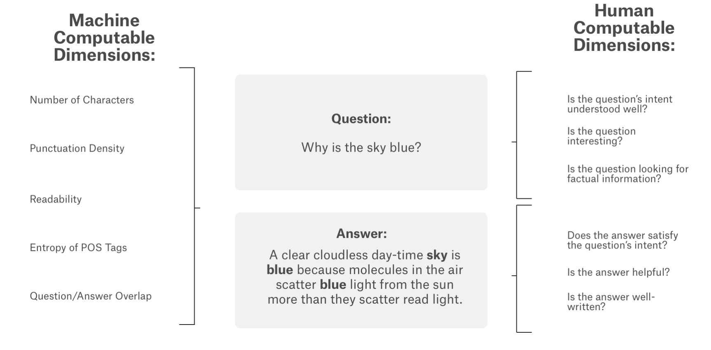

# Project Description

In this project, a predictive model to evaluate the quality of question-answer pairs based on subjective labels, such as helpfulness, relevance, interestingness, and clarity has been developed. Using a crowdsourced dataset from 70+ websites, leveraged BERT (Bidirectional Encoder Representations from Transformers) for natural language understanding and linear regression to predict subjective aspects of the Q&A pairs. The goal was to demonstrate that subjective qualities of answers, which often require common-sense interpretation, can be predicted reliably through machine learning, contributing to the development of more human-like Q&A systems.
Text Labelling using BERT. 

This is a [Google Quest Kaggle challenge](https://www.kaggle.com/competitions/google-quest-challenge) project.

Image source: [Kaggle](https://www.kaggle.com/competitions/google-quest-challenge)

## Key Skills Learned:
1. Natural Language Processing (NLP): Working with BERT for understanding and processing text data, improving context interpretation in subjective question-answering.
2. Machine Learning: Implementing regression techniques, particularly linear regression, to predict continuous subjective labels.
3. Data Preprocessing/ETL (Extract Transform Load): Handling and preparing crowdsourced Q&A data for training models, including tokenization, text embedding, and feature extraction.
4. Model Evaluation: Assessing model performance and tuning hyperparameters to achieve accurate predictions for subjective aspects of answers.
5. Transformer Architecture: Learnt Encoder-Decoder blocks and attention mechanism.

## Technological Stack
1. BERT (Bidirectional Encoder Representations from Transformers): Used for contextual text understanding and feature extraction from question-answer pairs.
2. Hugging Face Transformers: Utilized for loading and fine-tuning the BERT model.
3. Scikit-learn: Used for regression modeling, evaluation, and metrics.

#### More details can be found in report.pdf.

